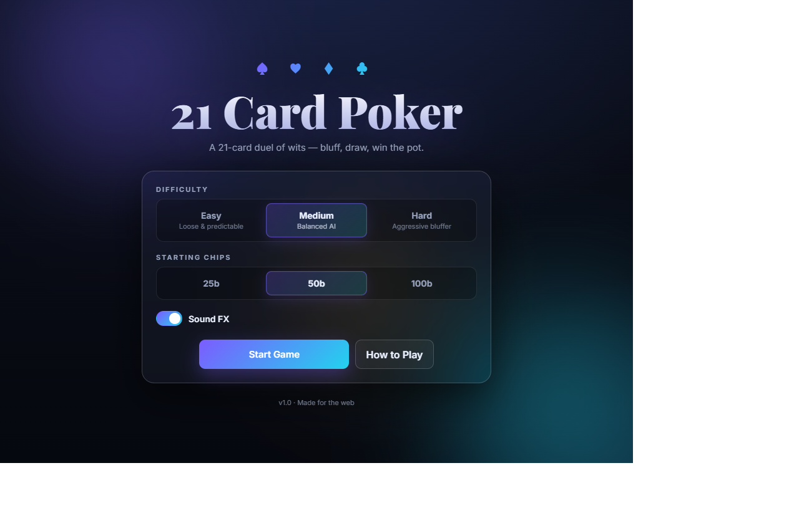
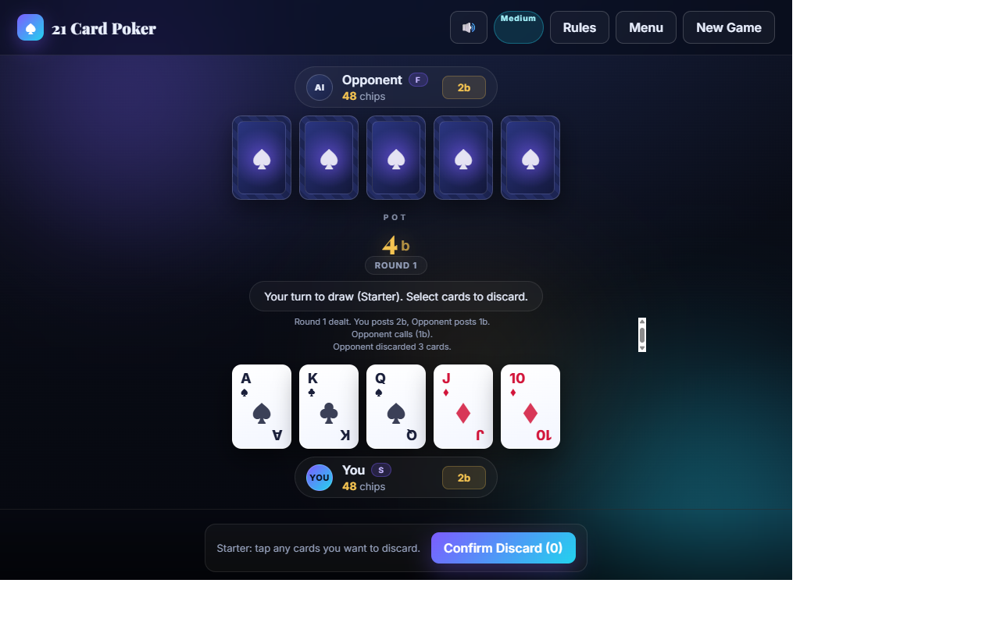

# 21 Card Poker

> A modern web port of a 2-player **21-card poker** game — bluff, draw, and outwit the AI.

🎮 **Play it now: https://scooterstuff.github.io/21-card-poker/**




---

## About

21 Card Poker is a simplified, fast-paced poker variant played with **20 high cards (A, K, Q, J, 10) + 1 Joker**. Each round is a duel between two players with forced bets, a single draw phase, and a showdown. The Joker is wild and resolves at showdown to whichever card maximizes its holder's hand.

This repo contains:

- A **web game** (vanilla JS, no build step) deployed via GitHub Pages — see [`web/`](web/)
- The original **Python desktop game** (Tkinter) — see [`main.py`](main.py) and [`core/`](core/)
- **Strategy / probability analysis** scripts and CSVs — see [`analysis/`](analysis/) and [`docs/`](docs/)

## Features (web version)

- 🎨 Modern dark UI with glassmorphism, animated cards, and showdown reveal
- 🎚️ **Difficulty selector** — Easy / Medium / Hard / **Expert (CFR-trained)**
- 🧠 **Expert AI** powered by an external-sampling MCCFR strategy trained in the
  sibling repo [ScooterStuff/21-card-poker-cfr](https://github.com/ScooterStuff/21-card-poker-cfr)
- 💡 **Show advice for me** — surfaces the optimal bet / discard from the CFR strategy
- 🤖 **Show CFR reasoning** — reveals the Expert AI's action-probability distribution each turn
- 🔊 **Sound FX** synthesized via Web Audio (no asset files), toggleable
- 💰 Configurable starting chips (25b / 50b / 100b)
- 🎴 Click-to-select discard, raise slider, live bet log, role pills (S/F)
- 📱 Responsive layout — playable on mobile
- 💾 Preferences persisted in `localStorage`

## Game rules (TL;DR)

| | |
|---|---|
| **Deck** | 20 cards (A, K, Q, J, 10 in 4 suits) + 1 Joker |
| **Forced bets** | Starter (S) posts 2b, Follower (F) posts 1b |
| **Pre-draw** | F acts first — Call / Raise / Fold |
| **Draw** | F discards 0–5 cards, draws replacements, then S does the same |
| **Post-draw** | S acts first — Check / Raise / Call / Fold |
| **Showdown** | Best 5-card hand wins; Joker resolves to best card |

Hand ranks (high → low): **Five of a Kind → Royal Flush → Four of a Kind → Full House → Straight → Three of a Kind → Two Pair → Pair**.

Full rules: [docs/21-card-poker-rules.md](docs/21-card-poker-rules.md).

## Run locally

### Web (no install required)

```powershell
cd web
python -m http.server 8080
# open http://localhost:8080
```

Or just open `web/index.html` directly in any modern browser.

### Python desktop (Tkinter)

```powershell
python main.py
```

## Project structure

```
web/                   # Vanilla JS web game (deployed to GitHub Pages)
  index.html
  styles.css
  js/
    game.js            # Deck, betting, round flow
    hand_eval.js       # Hand ranking + Joker resolution
    ai.js              # Heuristic AI with Easy/Medium/Hard profiles
    cfr_ai.js          # CFR-trained Expert AI + advice helpers
    sound.js           # Web Audio FX engine
    main.js            # UI controller
  data/
    cfr_strategy.json  # Compact MCCFR strategy file (loaded at runtime)
core/                  # Original Python desktop version
analysis/              # Probability, discard, meta-strategy calculators
data/                  # Generated CSV analysis outputs
docs/                  # Rules + strategy docs
.github/workflows/     # GitHub Pages deploy
```

## Deploy

The repo auto-deploys the `web/` folder to GitHub Pages on every push to `main` via [`.github/workflows/deploy.yml`](.github/workflows/deploy.yml).

The same folder works as-is on Netlify, Vercel, Cloudflare Pages, or any static host — see [`web/README.md`](web/README.md).

## License

MIT
